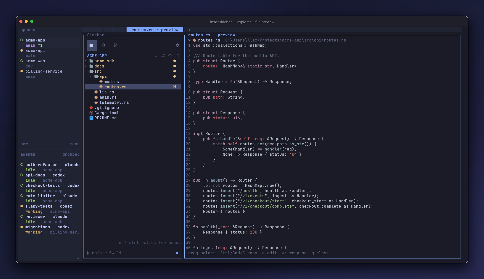
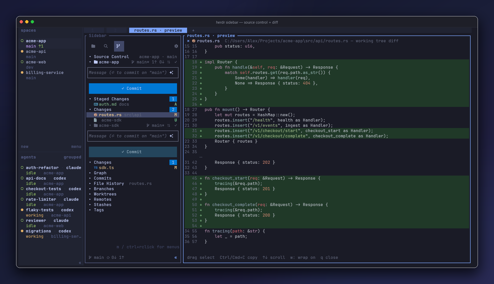
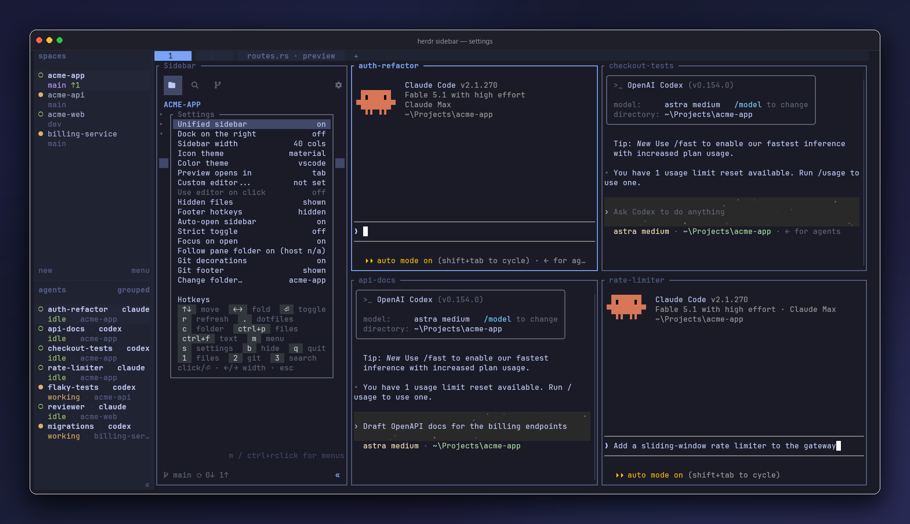

> **Fork.** This tree is [Cainiaooo/herdr-sidebar](https://github.com/Cainiaooo/herdr-sidebar),
> not the public [alexarthurs/herdr-sidebar](https://github.com/alexarthurs/herdr-sidebar)
> install. How we use and sync it: [`docs/FORK.md`](docs/FORK.md). What we changed:
> [`docs/CHANGELOG.md`](docs/CHANGELOG.md). Do not `git push` to upstream; do not
> `herdr plugin install alexarthurs/...` on this machine.

<div align="center">

# Herdr Sidebar

### The sidebar your terminal was missing — inspired by VS Code.

A file explorer and a full source-control panel in one dockable
[herdr](https://github.com/ogulcancelik/herdr) pane — activity-bar switching,
mouse-driven controls, AI-drafted commit messages, and file previews that open as editor
tabs — ephemeral until you double-click to pin one.


<br><br>


</div>

If you've ever alt-tabbed out of your terminal just to *look* at the tree, the diff, or
what's staged, this closes that loop.


```
herdr plugin install Cainiaooo/herdr-sidebar/plugins/herdr-sidebar --yes
```

That is **this fork**. The public upstream remains `alexarthurs/herdr-sidebar/plugins/herdr-sidebar` and does not include the per-workspace hide/show record. `--yes` is required when stdin is not a TTY.

Tagged releases install SHA-256-verified prebuilt binaries on supported Windows, macOS,
and Linux systems. Unsupported targets or unavailable assets fall back to a source build.


## Three Views

The activity bar switches Explorer, Search, and Source Control instantly in one process.
Use the mouse or press `1`, `2`, and `3`.

### Explorer & Preview

<div align="center">

</div>


- Disclosure chevrons, nested indentation, and **two icon themes** — colored Nerd Font
  glyphs (Atom-Material style) or emoji, toggled live. The sidebar auto-picks: material
  when a Nerd Font is installed, emoji otherwise — and on first run without one it
  offers to download and install JetBrainsMono Nerd Font for you (Windows, macOS,
  Linux). If the theme ever guesses wrong (icons showing as ⌷ tofu boxes), press `i`
  once; the choice persists.
- **Click a file and it opens in its own tab** — with the sidebar docked alongside it,
  mirroring the tree you clicked from. Your terminals are never moved. The tab is
  *ephemeral* (labelled `name · preview`), so clicking another file reuses it; **double-click**
  to pin it and the next file gets a fresh tab. Click a file that is already open and
  you jump to its tab instead of opening it twice. Closing a preview returns to the tab
  that opened it. Line numbers, scrolling,
  binary-safe, and **long lines wrap** — press `w` to switch wrapping off for the
  document you are reading.
- **Rather stay in one tab?** Set "Preview opens in" to `pane` in ⚙ Settings and the
  preview splits in right beside the sidebar instead, in the tab you clicked from —
  one viewer pane per tab, reused for every file, with focus left in the tree so you
  can keep walking it with the arrow keys. `q` or Esc closes just that pane.
- **Quick-open any file with `Ctrl+P`** — type a few characters from its path, use
  `↑`/`↓` to choose a fuzzy match, and press Enter to open it through the same reusable
  preview flow. The index follows the Explorer's dotfile setting, honors git ignore rules,
  and always skips `.git`.
- **Experimental in-pane editing** — press `e` in a regular UTF-8 file preview. The editor
  has a visible cursor, word-aware wrapping, wrapped-row scrolling, click/drag selection, find, and
  best-effort system clipboard integration. Saving is always explicit; unsaved exits and
  file switches ask first, and an external disk change can never be overwritten silently. The
  first actual edit pins the tab automatically, so later file clicks open a fresh preview tab.
  Diff and history previews remain read-only.
- **Follows the pane's live folder by default** — `cd` in a neighbouring shell (or point
  an agent at another project) and the tree and Source Control re-root within ~5s. A
  folder you choose manually stays selected until an already-seen pane actually changes
  folder; turn "Follow pane folder" off in ⚙ Settings for a fixed root.
- **Git status, right in the tree** — modified, added, deleted, untracked, conflicted
  and ignored files carry the same status letters and colors the Source Control view
  uses, and a folder shows a **dirty dot** when anything inside it changed, so you spot
  work without expanding a thing. Decorations refresh on their own every couple of
  seconds and immediately after you stage. Nested repositories decorate independently —
  an inner checkout's changes never leak into the parent's folders. Not for you? Turn
  "Git decorations" off in ⚙ Settings.
- **Stage from the tree** — "Stage Changes" in the context menu runs the `git add` for a
  file or a whole folder (additions, modifications *and* deletions), against the repo
  that actually owns the path. Staging a parent folder stops dead at a nested repository
  boundary, and staging something inside one stages it *there*.
- **Double-click folders** to fold, hover highlights, mouse wheel, and a context menu on
  **`m`** or **Ctrl+right-click** — no mouse required, which is what makes it work on
  mobile herdr clients: New File, New Folder, Open with Default App (files only — hands
  the file to the OS-associated app, like a double click in the file manager), Stage
  Changes, Rename, Delete, Copy Path / Relative Path, Reveal in File Explorer.
- Dotfiles toggle, live refresh, and a hide command when you want the columns back.
- Prefer the sidebar closed in some spaces (e.g. Perforce) and open in others (Git)?
  Hide with `b` / `«` or toggle it closed — that workspace is remembered off.
  Toggle it open and that workspace is remembered on. ⚙ "Auto-open (new spaces)" is
  only the default for workspaces you have not shown or hidden yet.
- Want one key to mean open/close? "Strict toggle" in ⚙ Settings closes an open sidebar
  even when it isn't focused, and "Focus on open" off docks it in the background so
  focus stays in the pane you toggled from.
- Prefer the tree on the other side? Toggle "Dock on the right" in ⚙ Settings; the choice
  persists for every future launch and auto-docked tab.
- Prefer a different width? Adjust "Sidebar width" with `←`/`→` in ⚙ Settings. The column
  target persists and is re-applied when the surrounding tab width changes.
- On a light terminal? Switch "Color theme" to `light`; it updates the complete sidebar,
  preview syntax, diffs, selections, and icons. `terminal` uses profile-mapped ANSI accents,
  while `vscode` preserves the original fixed dark palette and remains the default.


### Source Control

<div align="center">

</div>

- Stage, unstage, discard, commit, inspect diffs, and sync with the upstream.
- Click the branch name—in the panel header, a repository row, or the Git footer—to
  switch local branches or create a local tracking branch from a remote.
- Use one commit box per repository in multi-repo folders.
- Draft a commit message with the ✧ button through the local `claude` CLI, with a
  filename-based fallback when Claude is unavailable.
- Browse commits, file history, branches, worktrees, remotes, stashes, and tags.
- Keep branch and sync controls visible in every sidebar view with the compact Git footer;
  hide it from Settings if you prefer the extra row.


## Settings


<div align="center">

</div>

Settings persist across tabs and restarts. Configure:

- Unified or separate Explorer and Source Control panes
- Left/right docking and preferred width
- Material/emoji icons and VS Code/light/terminal colors
- Tab/pane preview placement and optional custom editor
- Hidden files, Git decorations, Git footer, and footer hotkeys
- Auto-open, strict open/close toggle, focus-on-open, and live folder following

The sidebar follows a neighbouring pane's working directory by default. A manually chosen
folder stays put until that pane changes directory again.

## Keys

| Explorer / Search | Action | Source Control | Action |
|---|---|---|---|
| `↑↓` / `jk` | move | `Enter` | stage / unstage |
| `←→` / `hl` | fold / unfold | `a` / `u` | stage all / none |
| `Enter` | toggle / preview | `c` | commit message |
| `Ctrl+P` | quick open | `A` | draft message |
| `Ctrl+F` | content search | `S` | sync |
| `.` | hidden files | `o` | open diff |
| `r` | refresh | `r` | refresh |
| `m` | context menu | `m` | context menu |
| `s` | settings | `s` | settings |
| `b` | hide | `b` | hide |
| `1` / `2` / `3` | change view | `1` / `2` / `3` | change view |

Preview: drag to select, `Ctrl/Cmd+C` to copy, arrows/PageUp/PageDown to scroll,
`w` to toggle wrapping, and `q` or Esc to close.

Host keybindings can invoke the direct `show-explorer`, `show-search`, `show-git`, and
`quick-open` actions. For example, bind `cmd+p` to:

```toml
[[keys.command]]
key = "cmd+p"
type = "shell"
command = "herdr plugin action invoke quick-open --plugin herdr-sidebar"
```

## Install & Develop

**Requirements:** herdr 0.8+. Source builds require Rust 1.89+.
A Nerd Font is recommended for material icons; the emoji theme works everywhere.

```sh
herdr plugin install alexarthurs/herdr-sidebar/plugins/herdr-sidebar
```

Local checkout:

```sh
cd plugins/herdr-sidebar
cargo build --release
herdr plugin link .
```

Open or toggle it:

```sh
herdr plugin action invoke herdr-sidebar.open-sidebar-windows   # Windows
herdr plugin action invoke herdr-sidebar.open-sidebar           # Linux / macOS
```

Useful development actions:


| Action | Purpose |

|---|---|
| `open-sidebar` / `open-sidebar-windows` | open, focus, or hide the sidebar |
| `open-git` / `open-git-windows` | toggle separate Source Control |
| `show-explorer`, `show-search`, `show-git` | open/focus one activity without toggling |
| `quick-open` | open/focus the sidebar and show the file picker |
| `redeploy` / `redeploy-windows` | refresh running sidebars after a rebuild |

Use the `-windows` suffix for each direct action on Windows.


## Actions

| Action | What it does |
|---|---|
| `open-sidebar` / `open-sidebar-windows` | Toggle the sidebar: open at its configured edge / focus / close |
| `open-git` / `open-git-windows` | Toggle a separate Source Control pane (separated mode) |
| `redeploy` / `redeploy-windows` | After a rebuild: refresh every workspace onto the new build |

Pressing `b` inside the plugin hides that tab's sidebar, snoozes auto-open there, and
remembers the **workspace** as hidden so a later click on another pane (Perforce, shell)
does not bring it back. Toggle it open again and that workspace is remembered as shown.

Herdr's built-in `prefix+b` (`Ctrl+b` then `b`) toggles **Herdr's own** workspace/agent
sidebar, not this plugin. Bind a different chord — do not steal `prefix+b` unless you
want that:

```toml
[[keys.command]]
key = "prefix+shift+b"
type = "shell"
command = "herdr plugin action invoke open-sidebar-windows --plugin herdr-sidebar" # Windows
description = "toggle herdr-sidebar"
```

Use `open-sidebar` instead of `open-sidebar-windows` on Linux or macOS, then run
`herdr server reload-config`. You can also run that invoke from any pane.

## Under the hood

- **One self-contained Rust crate** — ratatui + crossterm + serde, nothing else. Both
  views compile into one binary; separated panes are the same binary pinned with `--view`.
- All herdr control (docking, labels, identity tokens, pane spawning) goes over **herdr's
  socket API directly**; the Windows focus hooks run a windowless GUI-subsystem sidecar so
  nothing ever flashes a console window.
- Both dock sides survive real layouts — edge-aware split/swap, mirrored full-height repair,
  ratio-aware resizing, and preview-tab docking are unit-tested against herdr's actual JSON.
- Windows quirks (exe locking, PowerShell 5.1 BOMs, double-width Nerd Font glyphs) are
  handled, and the hard-won findings are documented in [`CLAUDE.md`](CLAUDE.md).

---


<div align="center">
<sub>Screenshots: herdr on Windows Terminal with a Nerd Font.</sub>
</div>
